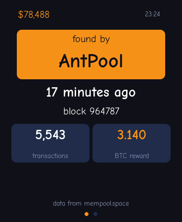
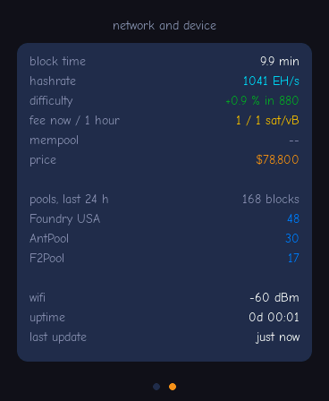

# bitBlockfinder

Shows on a **Waveshare ESP32-S3-Touch-AMOLED-1.8** who found the current
Bitcoin block and how long ago that was.

<p>
  
  
</p>

Two pages, swipe with your finger:

1. **Block** — the pool on an orange field, the block's age, its height,
   transactions and reward. Top left the BTC price, top right the clock.
   The age turns orange once it's older than twenty minutes.
2. **Network and device** — block time, hashrate, difficulty adjustment,
   fee estimate, mempool, price, the three biggest pools of the last
   24 hours, plus WiFi, uptime and the age of the last update.

The upper of the two buttons cycles brightness through three steps.
After 30 seconds without touch the display dims; it never turns fully off.

## What you need

* Waveshare ESP32-S3-Touch-AMOLED-1.8 (16 MB flash, 8 MB PSRAM)
* USB-C-to-USB-C **data cable** — a charge-only cable won't work
* WiFi on the 2.4 GHz band
* ESP-IDF 5.5 or newer

No account, no API key, no node of your own.

## Installation

**1. Set up ESP-IDF** — one time, takes a few minutes:

```bash
git clone -b v5.5.5 --depth 1 --recursive https://github.com/espressif/esp-idf.git ~/esp/esp-idf
```

```bash
cd ~/esp/esp-idf && ./install.sh esp32s3
```

**2. Get this repo and set your WiFi:**

```bash
git clone https://github.com/thisdev/bitBlockfinder.git
```

```bash
cd bitBlockfinder && cp local.defaults.example local.defaults
```

Edit `local.defaults` with your SSID and password. The file is in
`.gitignore` and stays local.

**3. Connect the board and flash:**

```bash
./flash.sh
```

Builds, flashes and opens the serial monitor; exit it with Ctrl-]. `flash.sh`
loads the ESP-IDF environment itself and finds the board's port. By hand,
the same thing is `source activate.sh` followed by `idf.py build flash
monitor`.

Dependencies (the Waveshare BSP, LVGL) are pulled in by the component
manager on first build.

## Settings

Either in `local.defaults` or via `idf.py menuconfig` → *Blockfinder*:

| Option | Default | Meaning |
|---|---|---|
| `CONFIG_BF_WIFI_SSID` / `_PASS` | — | WiFi credentials |
| `CONFIG_BF_POLL_S` | `60` | seconds between two checks for a new block |
| `CONFIG_BF_SHOT_ENABLE` | off | serves `/shot` and `/page?n=` for screenshots |

## Where the data comes from

From [mempool.space](https://mempool.space)'s public REST API:

| Endpoint | for | size | how often |
|---|---|---|---|
| `/api/blocks/tip/hash` | is there a new block? | 64 B | every minute |
| `/api/v1/block/<hash>` | pool, time, fees | ~2 KB | only on a new block |
| `/api/v1/difficulty-adjustment` | block time, retarget | 340 B | every 10 min |
| `/api/v1/fees/recommended` | fee estimate | 74 B | every 10 min |
| `/api/mempool` | pending transactions | ~4 KB | every 10 min |
| `/api/v1/mining/pools/24h` | pools, hashrate | ~3 KB | every 10 min |
| `/api/v1/prices` | BTC price | 108 B | every 10 min |

The trick is the first line. Instead of fetching the list of the last
fifteen blocks every minute — 30 KB — the device asks for the hash of the
tip block and only fetches the block itself once that hash differs from
the one it already knows.

The device computes the block's **age itself** from the block time and
the NTP clock, so the minute count keeps advancing even while WiFi is
down. If one of the requests fails, that value keeps its last known
state instead of dropping to zero.

## Layout

| File | |
|---|---|
| `main/bitblockfinder.c` | flow: what gets fetched and drawn, and when |
| `main/chain.c` | parsing mempool.space's responses |
| `main/fetch.c` | HTTPS against the root certificate bundle |
| `main/ui.c` | the two pages |
| `main/net.c`, `clock.c` | WiFi and NTP |
| `main/backlight.c` | button and idle dimming |
| `main/shot.c` | HTTP screenshots, off by default |
| `main/schrift/` | Comic Neue as LVGL fonts |

## Font, colors and license

The font is **Comic Neue** under the SIL Open Font License; license and
build steps are in [`main/schrift/`](main/schrift/README.md).

Colors are taken from mempool.space's own stylesheet: background
`#11131f`, cards `#272f4e`, plus their accent colors on the second page.
The first page uses only white and Bitcoin orange `#f7931a` — it's meant
to be read, not decoded.

The code is [MIT-licensed](LICENSE): free to use, modify and share,
attribution required.
